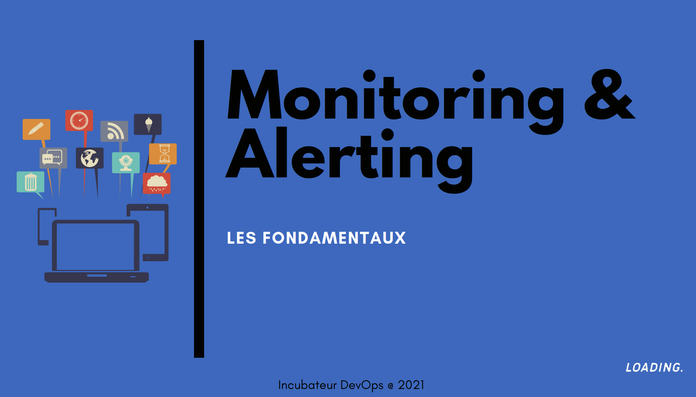

# Wiki du projet Monitoring&Alerting

Dans ce wiki, vous trouverez les informations sur les tenants et aboutissants du projet _Monitoring & Alerting_.
## Sommaire
- Informations client
  - [L'équipe](#léquipe)
  - [Demande d'accès](#demande-daccès)
  - [Grafana](#point-dentrée)

- Informations technique
    - [Vagrant](./Vagrant.md)
    - [Ansible](./Ansible.md)
    - [Telegraf](./Telegraf.md)
    - [InfluxDB](./InfluxDB.md)
      - [Rétention de données](./Retention-de-données.md)
    - [Grafana](./Grafana.md)
    - [Dashboard Memento](./Ajout-de-dashboard.md)

### L'équipe

Les membres du groupe pour l'année 2020/2021 sont :
- [Brice Michalski](mailto:brice.michalsky@ynov.com)
- [Killian Cambus](mailto:killian.cambus@ynov.com)
- [Ilya Yakubenka](mailto:ilya.yakubenka@ynov.com)
- [Youssef Madhous](mailto:youssef.madhous@ynov.com)
- [Lucas Fournier](mailto:lucas.fournier@ynov.com)
- [Thibaut GUILLAUD](mailto:thibaut.guillaud@ynov.com)
- [Baptiste Porte](mailto:baptiste.porte@ynov.com)
- [La team Monitoring et alerting](mailto:brice.michalsky@ynov.com,killian.cambus@ynov.com,ilya.yakubenka@ynov.com,youssef.madhous@ynov.com,lucas.fournier@ynov.com,thibaut.guillaud@ynov.com,baptiste.porte@ynov.com)

### Demande d'accès

En tant que nouveau membre, vous devez contacter [_insert a person to contact_] pour que nous puissions déployer nos sondes de supervision sur vos machines. Si vos machines ont été déployées par l'équipe _Cloud VM_, les sondes ont déjà été déployées.

### Point d'entrée

Votre point d'entrée sera [Grafana](https://127.0.0.1). Une fois connecté à cette adresse, il faudra renseigner les identifiants qui vous seront communiqués par [_insert a method_].
A partir de là, vous aurez un accès complet à toutes les données concernant vos serveurs.
Si vous avez des besoins de supervision spécifiques, n'hésitez pas à contacter [_insert a person to contact_] afin que nos équipes puissent répondre à votre besoin dans les meilleurs délais.

### Diapo de sensibilisation au monitoring

L'image ci-dessous vous amenera vers un rappel des fondamentaux du **monitoring et de l'alerting**\
